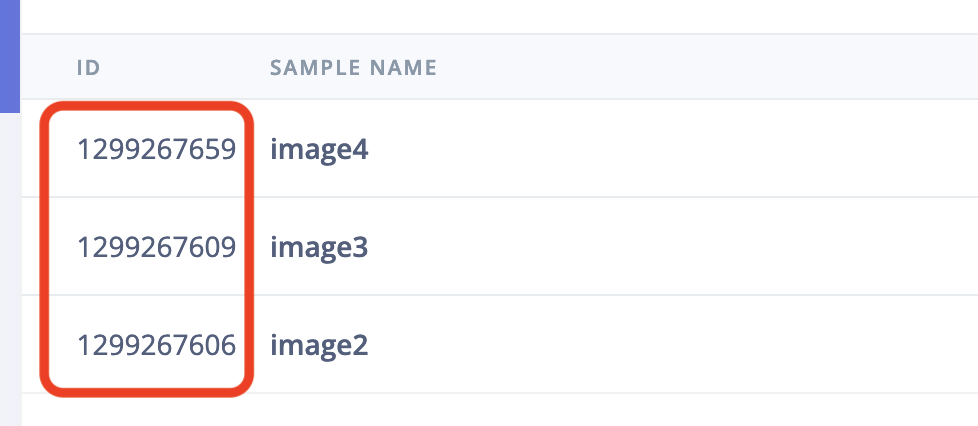

# AI labeling block: Bounding box validation Using GPT-4o

Let GPT-4o look at every image in your object detection dataset and check against a validation prompt you provide. If images are not compliant they will be disabled and reasoning will be put into the metadata. The block passes each image's bounding boxes and labels to GPT-4o so you can for example check if "The bounding boxes and labels do not correspond to to the objects in the image" among other things.


## Use this from Edge Impulse

If you just want to use GPT-4o as a data validation tool in your Edge Impulse project you don't need this repo. Just go to any project, select **Data acquisition > AI labeling**, choose **Bounding box validation Using GPT-4o**.

> You'll need an OpenAI API Key, see [OpenAI Platform > API Keys](https://platform.openai.com/api-keys).

## Developing your own block

You can use this repository to develop your own block that uses GPT-4o (or some other LLM) to help you do data curation (or other tasks).

1. Create a new Edge Impulse project, and add some images.
2. Create a file called `ids.json` and add the IDs of the samples you want to label. You can find the sample ID by clicking the 'expand' button on **Data acquisiton**.

    

    Add these IDs to the `ids.json` file as an array of numbers, e.g.:

    ```json
    [1299267659, 1299267609, 1299267606]
    ```

3. Load your API keys (both Edge Impulse and OpenAI):

    ```
    export OPENAI_API_KEY=sk-M...
    export EI_PROJECT_API_KEY=ei_44...
    ```

    > You can find your OpenAI API key on the [OpenAI API Keys](https://platform.openai.com/api-keys) page. You can find your Edge Impulse API Key via **Dashboard > Keys**.

4. Install Node.js 20.
5. Build and run this project to label your data:

    ```
    npm run build
    node build/llm-validation.js \
        --validation-prompt "- The bounding boxes and labels do not correspond to to the objects in the image\n- The image is not clear enough to determine the objects in the image" \
        --concurrency 10 \
        --data-ids-file ids.json
    ```

6. Afterwards you'll have labeled data in your project.

### Pushing block to Edge Impulse (enterprise only)

If you've modified this block, you can push it back to Edge Impulse so it's available to everyone in your organization.

1. Update `parameters.json` to update the name and description of your block.
2. Initialize and push the block:

    ```
    $ edge-impulse-blocks init
    $ edge-impulse-blocks push
    ```

3. Afterwards, you can run your block through **Data acquisition > AI labeling** in any Edge Impulse project.

### Proposed changes

AI labeling blocks should be able to run in 'preview' mode (triggered when you click *Label preview data* in the Studio) - where changes are _staged_ but not directly applied. If this is the case `--propose-actions <job-id>` is passed into your block. When you see this flag you should not apply changes directly (e.g. via `api.rawData.editLabel`) but rather use the `setSampleProposedChanges` API. Search for this API in [llm-validation.ts](llm-validation.ts) to see how this should be used.
